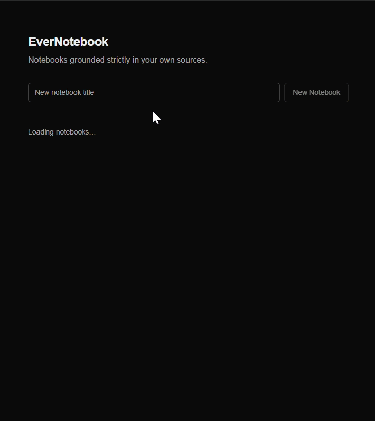
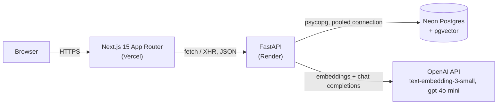

# EverNotebook

**Live:** https://ever-notebook.vercel.app

EverNotebook is a minimal NotebookLM clone: create a notebook, add sources (pasted text or PDF upload), and chat with them. Every answer is grounded strictly in that notebook's sources — retrieval-augmented generation over `text-embedding-3-small` + `gpt-4o-mini` — with inline citations that resolve to the exact character range of the source text they came from, plus an on-demand summary. Built end-to-end (schema through deployment) as a timed take-home.

## Screenshot

<!-- TODO: screenshot of a notebook's chat view with an answer, inline citation markers, and the footnote list -->


## Architecture



**Why a FastAPI/Next.js split instead of one Next.js app (API routes only).** A single Next.js app would deploy as one Vercel target and remove the CORS/two-origin concern entirely. Rejected because the backend needs Python-native tooling (`pypdf`, `psycopg` + `pgvector.psycopg`) that a Next.js API route doesn't give you cleanly, and because a visible API boundary is itself part of what a take-home like this is evaluated on — collapsing it into one app hides that signal.

## Key Decisions

Each states the alternative that was rejected and why. Full reasoning in [docs/PRD.md](docs/PRD.md) §5.

- **Render + Vercel + Neon, not AWS.** AWS gives more control (VPC, autoscaling, no cold starts) but every piece — IAM, networking, RDS provisioning, a deploy pipeline — costs setup time a fixed time budget doesn't have. Trade-off accepted: Render's free tier cold-starts after 15 minutes idle.
- **No ivfflat/hnsw vector index, exact cosine scan instead.** An ANN index pays off at tens of thousands of rows; at demo scale, an exact scan filtered by `notebook_id` is fast, needs no index-training step, and returns exact rather than approximate neighbors. Scale-dependent, not permanent.
- **Character-offset citations, not chunk-ID-only citations.** A chunk-ID citation says "this ~1000-char chunk supports the claim" but not where. Storing exact `start_char`/`end_char` lets the UI quote the precise supporting text, at no extra runtime cost since offsets are computed once at chunk time.
- **No streaming.** Citation validation needs the full response before it can run regardless (markers can't be checked against the chunk set mid-stream), so streaming would add transport complexity without removing that dependency.
- **Citations resolved via response-order mapping, not structured JSON output from the model.** The backend already knows, in order, exactly which chunks it sent. Asking the model for plain-text `[1]`..`[k]` markers referencing that known order — then validating server-side — avoids depending on the model correctly emitting a citation schema.
- **Stateless single-turn chat, not multi-turn memory.** The schema has no message-persistence table; any history would be client-only and best-effort. Stateless retrieval matches "grounded strictly in that notebook's sources" literally — every answer is freshly grounded, not built on a prior unverified answer.
- **Manual "Generate Summary," not auto-regenerate on every source change.** Avoids invalidation logic and an upload-mid-generation race, and is a clearer, more visible action for a reviewer to trigger.

## Non-Goals

| Excluded | Rationale |
|---|---|
| Auth / multi-user | No product requirement for user separation at this scale; adds meaningful build time for zero grading value. |
| Audio overview / podcast | Separate generation pipeline the time budget doesn't support. |
| Mind maps | Distinct feature, not core to grounded chat + citations. |
| Persistent file storage | PDFs are processed in-memory at upload; only extracted text is persisted — avoids needing object storage. |
| Source editing | Sources are write-once; editing would need re-chunking, re-embedding, and citation invalidation. |
| Streaming responses | Citation validation needs the full response regardless — see Key Decisions. |
| Mobile-optimised layout | Grading happens on a desktop browser. |
| OCR | `pypdf` reads embedded text only; scanned/image PDFs are rejected with a clear error, not silently emptied. |

## Review & Triage

Two independent reviewers ran with **no project context** — a black-box product review against only the deployed API ([docs/reviews/product-review.md](docs/reviews/product-review.md)), and a two-axis Standards/Spec code review against the diff ([docs/reviews/code-review.md](docs/reviews/code-review.md)).

| Severity | Finding | Source | Status |
|---|---|---|---|
| Critical | No auth — every notebook world-readable | Product | Open — non-goal |
| High | Prompt injection can hijack output; injecting source not always cited | Product | **Fixed** |
| Medium | Empty question string → unhandled 500 | Product | **Fixed** |
| Medium | Empty/whitespace-only sources silently accepted | Product | Open |
| Low | Citations are chunk-granular, not sentence-granular | Product | Open — accepted trade-off |
| Low | `/summary` on an empty-content notebook returns raw LLM filler | Product | Open |
| — | Duplicated ingestion pipeline (text vs. PDF endpoints), duplicated 404 guard, duplicated frontend error-extraction logic, `useState` data-clumps in the notebook page | Code, Standards | Open |
| — | Task 8 cold-start UI has no elapsed-time threshold; no schema migration file in repo; DB connection held across the synchronous embedding call | Code, Spec | Open — see below |

**Fixed:**
- **Prompt injection.** The chat system prompt now explicitly frames retrieved chunks as untrusted data inside a delimited `<sources>` block — content to potentially cite, never instructions to obey. Re-ran the reviewer's exact payload 3 times against the live API: the injected directive no longer appears in any run (previously 3/3). Separately, an answer that retrieved real notebook context but ends up with zero citations now carries a visible `warning` field, rendered in the chat panel, instead of looking indistinguishable from an ordinary, fully-cited answer.
- **Empty question → 500.** `ChatRequest.question` now rejects blank/whitespace via validation; both the empty-string and whitespace-only cases return a clean 422 (previously an unhandled 500 and a silent 200 respectively).

**Declined, with reasons:**
- **No auth** — an explicit non-goal. The reviewer reading another notebook is that non-goal working as designed, not a new defect.
- **Duplicated ingestion pipeline** between the text and PDF source endpoints — a real smell, accepted under the time budget.
- **Cold-start elapsed-time UI threshold** — the cron-job.org ping against `/health` is the actual mitigation; the UI state was always polish on top of it.
- **No schema migration file** — the DDL was applied by hand directly to Neon.
- **Chunk-granular rather than sentence-granular citations** — offsets were verified accurate to the chunk boundary; sentence-level granularity was out of scope.
- **DB connection held across the synchronous embedding call** — known, matches PRD §6's stated risk, unmitigated under concurrency.

**Prompt injection is mitigated, not solved.** The hardened prompt measurably closed the reproduced payload, but prompt injection is an open research problem — no prompt-level framing makes an LLM provably safe against all future payloads.

## What I'd Do With Another Day

- Auth (per-user notebooks; the single biggest gap the product review surfaced)
- Streaming responses, once citation validation can run incrementally
- Hybrid search — BM25 + vector, not vector-only retrieval
- A retrieval-quality eval harness (a fixed set of question/expected-citation pairs, run on every ingestion or prompt change)
- Dedupe the ingestion pipeline shared between the text and PDF source endpoints
- Migrate off Render/Vercel free tiers to AWS Lambda or App Runner for cold-start elimination and real concurrency headroom

## How I Worked

Problem framing and hard constraints first, one grilling round to pressure-test the plan before writing any code, a PRD, then a dependency-ordered issue breakdown. Implementation ran goal-driven against those issues, verified against the deployed URLs at each step rather than localhost. Once the core loop was live, two independent reviewers — with no prior context on this project — ran a black-box product review and a two-axis code review; findings were triaged and fixed or explicitly declined above.

- [docs/PRD.md](docs/PRD.md) — problem, non-goals, architecture decisions, known risks
- [docs/ISSUES.md](docs/ISSUES.md) — the dependency-ordered task breakdown
- [docs/reviews/](docs/reviews/) — the two independent reviews
- [docs/transcripts/](docs/transcripts/) — raw session transcripts of the entire build

## Local Setup

Requires Python 3.12+, Node 18.18+, a Neon Postgres connection string, and an OpenAI API key.

Create `api/.env` and `web/.env.local` from their `.env.example` templates first (`DATABASE_URL` + `OPENAI_API_KEY`; `NEXT_PUBLIC_API_URL=http://localhost:8000`). Then, in two terminals:

```bash
pip install -r api/requirements.txt
uvicorn main:app --reload --app-dir api
```

```bash
npm --prefix web install
npm --prefix web run dev
```
